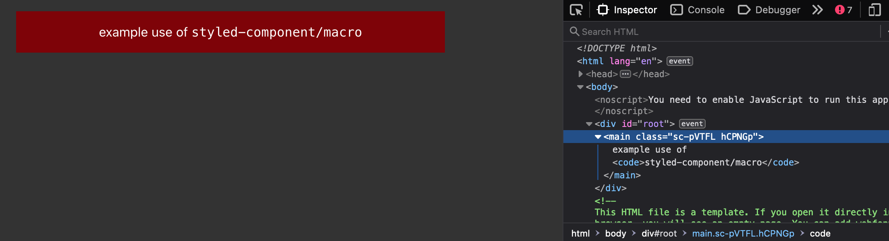
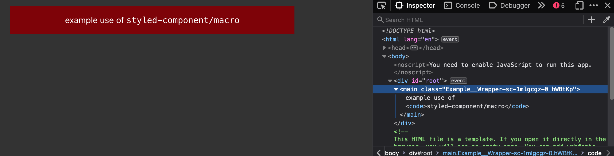

# To recreate from scratch:

```sh
npx create-react-app react-app; cd react-app; npm install --save styled-components; npm install --save-dev babel-plugin-styled-components; npm run start;
```

Then edit styles.

Make sure to change `import styled from 'styled-components'` to be `import styled from 'styled-components/macro'` instead.

What went wrong? The class names are still hard to read, something like `.sc-pVTFL`:



## A temporary fix

It turns out this specific feature of the macro isn't working in releases 2.0.0 to 2.0.2 inclusive, but it still works in the last v1 release 1.13.3: https://github.com/styled-components/styled-components/issues/3635#issuecomment-998984151

```sh
npm install babel-plugin-styled-components@1.13.3
```

And now that class name from earlier is now prefixed with something more meaningful, like `.Example__Wrapper-...`:


